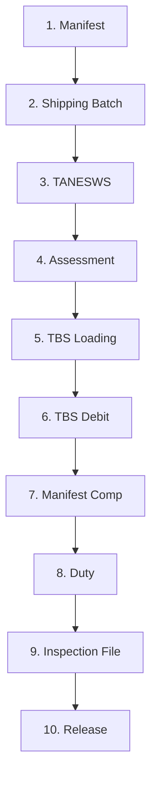

# KDL Tracker — Complete Operator Guide

**KDL Tracker** is the web application Kingdao Logistics uses to manage import consignments from vessel arrival, through customs clearance, to final release. It replaces the company’s old shared Excel workbook (`TRACKER_--_KDL.xlsx`) with a structured, multi-user system: real-time pipeline views, role-based access, audit history, and one-click reports.

**Who this guide is for:** people who are **completely new** — to shipping, to customs clearance, and to this app. You do **not** need any prior logistics knowledge. By the end you will understand *what the business does*, *why each step exists*, *how to use every screen*, and *how this app improves on the spreadsheet it replaced*. If you later want to know how the software is built (database, security, architecture), read [`doc.md`](doc.md).

> **How to read this guide:** If you’re brand new, read sections 1–3 slowly — they teach the shipping world. Then section 6 is your hands-on “how do I actually do my job” walkthrough. Sections 9 and 11 explain the old Excel sheet and why the app is better. Skim the rest as needed.

---

## Table of contents

1. [What Kingdao does (in plain English)](#1-what-kingdao-does-in-plain-english)
2. [Shipping 101 — jargon buster](#2-shipping-101--jargon-buster)
3. [The 10-stage clearance pipeline](#3-the-10-stage-clearance-pipeline)
4. [Getting started — your first login](#4-getting-started--your-first-login)
5. [Sidebar map — every screen explained](#5-sidebar-map--every-screen-explained)
6. [Day-to-day workflows (step by step)](#6-day-to-day-workflows-step-by-step)
7. [Screen reference](#7-screen-reference)
8. [Special shipment types](#8-special-shipment-types)
9. [How the old Excel tracker worked (in detail)](#9-how-the-old-excel-tracker-worked-in-detail)
10. [Using the app on mobile and tablet](#10-using-the-app-on-mobile-and-tablet)
11. [App vs Excel — the same shipment, two ways](#11-app-vs-excel--the-same-shipment-two-ways)
12. [For developers](#12-for-developers)

---

## 1. What Kingdao does (in plain English)

### The problem we solve

A business in Tanzania — say a motorcycle dealer or a steel factory — buys goods from overseas (often China). Those goods are packed into steel **shipping containers**, loaded onto a giant **cargo ship** (the *vessel*), and sailed across the ocean to the **Port of Dar es Salaam**.

Here is the part most people don’t realise: **a container cannot just roll off the ship and drive to the buyer.** The Tanzanian government has to be satisfied first. Several different agencies are involved, each with its own forms, fees, and checks:

- **TRA** (Tanzania Revenue Authority) — the tax office. It decides how much **import duty** (tax) the goods owe and collects it.
- **TBS** (Tanzania Bureau of Standards) — checks the goods are safe and legal to sell, and charges a standards fee.
- **The port and the ICDs** (inland container depots) — the physical yards where containers sit while all this happens.
- **TANESWS** (the electronic “single window”) — the government website where all the documents get filed.

Only after every box is ticked does the government issue a **Release Order**, and *only then* can the container leave the yard on a truck.

### Where Kingdao fits

Most importers don’t know how to navigate all of that, and they don’t have the time. So they hire a **customs clearing and forwarding agent** — that’s us, **Kingdao Logistics (KDL)**, based in Dar es Salaam. We are the experts who:

1. Receive the shipping documents from the importer.
2. File everything with the right agencies, in the right order.
3. Pay the duties and fees on the client’s behalf.
4. Arrange the inspection.
5. Get the **Release Order** and hand the goods over.
6. Send the client a bill (and an official tax receipt — the **EFD**) for our service.

We do this for **one shipment at a time**. Each shipment we’re hired to clear is called a **consignment** — that is the single most important word in this app. A consignment is one job, one folder, one row. It might be one container, a batch of six containers, or a single imported car.

### Why speed is money

Here is the pressure that makes this whole app worth building: **while a container sits in a yard waiting to clear, the client is charged daily penalty fees.** These are called **demurrage** (charged by the shipping line) and **storage** (charged by the depot). They add up fast. If a job gets *stuck* — waiting on a payment, a document, an inspection — every extra day costs the client real money, and they hold KDL responsible for the delay.

So the entire job of this tracker is to answer three questions, instantly, for all ~400+ jobs we handle per year:

1. **Where is every shipment right now?** (Which step is it on?)
2. **What is blocking it?** (What needs to happen next?)
3. **Who is working on it?** (Whose job is the next step?)

The old answer to those questions was “scroll through a giant spreadsheet.” The new answer is this app.

---

## 2. Shipping 101 — jargon buster

You will hear these terms constantly. Learn them once and the rest of the app makes sense.

| Term | Meaning | Simple analogy |
|------|---------|----------------|
| **Consignment** | One clearance job in the system | A folder for one shipment you are clearing |
| **REF No** | Internal reference, 7 digits (e.g. `9900001`) | KDL’s own job number, like a ticket number |
| **B/L (Bill of Lading)** | The shipping line’s document number | The carrier’s “tracking number” for that cargo |
| **TANSAD No** | Tanzania Single Administrative Document number | The official customs declaration — the shipment’s “tax form” |
| **Vessel** | The cargo ship | How the goods physically arrived |
| **ICD** | Inland Container Depot | A secure yard where containers wait (e.g. African ICD, Galco, Hesu, DP World) |
| **IN REF** | Invoice reference (e.g. `TZ3`, `HB2`) | A code that groups several B/Ls onto one combined invoice |
| **EFD** | Electronic Fiscal Device receipt | The official TRA fiscal receipt for KDL’s service fee |
| **Manifest** | The ship’s official cargo list | Must exist before clearance can even start |
| **TANESWS** | Tanzania Electronic Single Window System | The government portal where documents are filed |
| **Assessment** | TRA’s duty calculation step | Customs decides how much tax the client owes |
| **TBS** | Tanzania Bureau of Standards | Standards compliance system and fees |
| **Duty** | Import tax | The main customs tax payment |
| **Release** | Government permission to leave the depot | The finish line — goods can go to the client |
| **Demurrage / storage** | Daily penalty fees for delay | The reason a “stuck” job is an emergency |

**Container types you’ll see in the app:** `40FT` (a 40-foot container), `20FT` (a 20-foot container), `CAR` (a single private vehicle), and `COIL` (steel coils, counted by the coil, not the box).

> **A note on REF numbers:** KDL’s internal job numbers are 7 digits and start with `99` (e.g. `9900042`). If an old record has a shorter number, the importer pads it with leading `9`s and flags it for a human to double-check.

---

## 3. The 10-stage clearance pipeline

Every consignment moves through **ten pipeline stages**, in order — like a board game where the token must land on every square from start to finish. Each stage has a **status** that progresses:

- **Waiting** (grey) — not started yet.
- **Action** (amber) — someone is actively working on it *right now*.
- A **done value** (green) — the stage is complete. The exact word differs per stage (e.g. *Uploaded*, *Closed*, *Paid*, *Released*).

> **EFD is not a pipeline stage.** The official fiscal receipt (EFD) is handled *separately*, after release, in the **EFD Records** section. It is not a column on the Kanban board. (Some older docs describe an “11th stage” — that was just a simplification; in the app, EFD lives on its own.)



### Stage-by-stage — what each step means in the real world

| # | Stage | What actually happens | “Done” value |
|---|--------|------------------------|--------------|
| 1 | **Manifest** | The ship files its official cargo list with customs. Nothing can start until this list is uploaded. | **Uploaded** |
| 2 | **Shipping Batch** | The container is moved from the crowded port to an inland depot (ICD) and settled there (the “carry-in”). | **Done** (may pass through *PREPARED*, *W/CARRY IN*, *CARRY IN END*) |
| 3 | **TANESWS** | KDL logs into the government single-window portal and files the cargo documents to begin clearance. | **Done** |
| 4 | **Assessment** | TRA reviews the documents and calculates the duty owed. Once the figure is locked, it is *Closed*. | **Closed** |
| 5 | **TBS Loading** | The shipment’s data is entered into the standards-bureau system. | **Done** |
| 6 | **TBS Debit** | The TBS standards fee is paid. | **Paid** (may be *SHARED* across a batch) |
| 7 | **Manifest Comp** | The customs paperwork is finalised and matched to the physical cargo. | **Done** |
| 8 | **Duty** | The main import duty (from stage 4) is paid. | **Paid** |
| 9 | **Inspection File** | Customs officers physically inspect the cargo to confirm it matches the documents. | **Done** |
| 10 | **Release** | The government issues the Release Order. Gates open, trucks load, goods leave the depot. | **Released** |

After release, finance records the **EFD** fiscal receipt against the consignment in the EFD Records section — closing the financial loop.

### Rules you cannot skip

The **database itself** enforces real-world order — not just the buttons on the screen. This means even a clever user who tries to bypass the app cannot break the sequence. For example:

- You **cannot** finish **TANESWS** until **Manifest** is uploaded.
- You **cannot** pay **TBS Debit** until **Assessment** is closed.
- You **cannot** **Release** until **Inspection File** is done.

**Going backward** (undoing a completed stage) is blocked for normal operators. Only an **admin** can force a backward move, and they must type a **reason** that is saved forever in the audit log. This prevents quiet mistakes and creates accountability.

**Before the ship arrives:** If a consignment has no **arrival date** yet, the app treats it as **Awaiting arrival** and keeps it parked in the waiting bucket. You cannot advance stages until arrival is recorded — because in the real world, you can’t clear cargo that hasn’t docked.

---

## 4. Getting started — your first login

1. **Get your URL and account** from an administrator. (For local development: run `pnpm dev` and open [http://localhost:3000](http://localhost:3000).)
2. Open the app — if you’re not signed in, it sends you to **Login**.
3. Enter your **email** and **password**. There is **no public sign-up** — admins invite users. This is intentional: it keeps financial data locked down.
4. After login, use the **sidebar** on the left. On a phone, tap the menu button (**Open navigation menu**) to reveal it.
5. **Know your role** — it controls what you can see and edit:

| Role | Typical user | What you can do |
|------|----------------|-----------------|
| **Admin** | Owner / manager | Everything: manage users and roles, force stage moves (with a reason), delete consignments, all reports |
| **Operator** | Clearing staff | Create and update consignments, advance pipeline stages, use Inbox, EFD, and Import |
| **Viewer** | Read-only / client-facing | View consignments and reports; **cannot** drag cards or change any stage |

Admins can also define **custom roles** with **per-column permissions** — for example, a junior operator who may edit the manifest stage but cannot see or change the `amount` (service fee). See [`docs/permissions.md`](docs/permissions.md).

---

## 5. Sidebar map — every screen explained

| Nav label | Route | Who sees it | What it’s for |
|-----------|-------|-------------|----------------|
| **Dashboard** | `/dashboard` | Everyone | KPIs, pipeline funnel, arrivals this week, overdue/stuck jobs |
| **Pipeline** | `/` | Everyone | Kanban board (desktop) or Triage list (mobile) of active jobs |
| **Consignments** | `/consignments` | Everyone | Searchable table of all jobs; filters and pagination |
| **Inbox** | `/inbox` | Admin, Operator | Your personal queue: stages in **Action** that *you* are allowed to update |
| **EFD Records** | `/efd` | Admin, Operator | Create and manage fiscal receipt codes; link them to consignments |
| **Import** | `/import` | Admin, Operator | Upload the legacy Excel tracker for preview and one-time migration |
| **Reports** | `/reports` | Everyone | Revenue, volume, turnaround, bottlenecks; export XLSX/PDF |
| **Settings** | `/settings` | Admin only | Invite users; manage roles and per-column permissions |

Sign out via the footer control at the bottom of the sidebar.

---

## 6. Day-to-day workflows (step by step)

This is the practical heart of the guide. If you only read one section, read this one.

### A. Start your shift (operator)

1. Open **Dashboard**.
2. Glance at **Released today**, **Pending release**, and **Stuck > 48h** (clicking these jumps to a filtered consignment list).
3. Open **Inbox** — your focused to-do list. It shows *only* stages in **Action** that you have permission to write. Nothing here that isn’t yours.
4. Click **Open →** on a row (or tap the card on mobile) to open the consignment.
5. Update the active stage from the **Pipeline** tab or the stage action menu.

### B. Move a job forward (three ways)

There are three ways to advance a stage. They all do the same thing — pick whichever fits your device and habit.

**Option 1 — Kanban board (desktop, screen width ≥ 768px)**

1. Go to **Pipeline**.
2. Make sure the **Kanban** tab is selected (desktop also has a **Triage** tab).
3. Find the card in the column for its current stage.
4. **Drag the card one column to the right** — this marks the current stage complete and advances it one step.
5. Dragging **backward** is **admin only** — you’ll be prompted to enter a reason.

**Option 2 — Triage (the default on phones, also a desktop tab)**

1. Go to **Pipeline** (on a phone you land on **Triage** automatically).
2. Open the **Action Needed** section — stuck jobs appear first with a **STUCK** badge.
3. **Tap a row** — a bottom drawer slides up.
4. Use **Mark {Stage} {DoneValue}** (e.g. “Mark Manifest Uploaded”) or **Set to Action**.
5. Tap **Open detail →** if you need the full record.

**Option 3 — Consignment detail**

1. Open any consignment → **Pipeline** tab.
2. Use the stage menu on the active (incomplete) stage — the same buttons as Triage, including intermediate values like *PREPARED*.

### C. Create a new consignment

1. Go to **Consignments** → **New consignment**, or **Pipeline** → **New**.
2. Fill the required fields: **Client** and **Year**.
3. Add the logistics fields as you know them: B/L, TANSAD, vessel name, **arrival date**, container count/type, ICD, amount, remarks.
4. Click **Create consignment**.
5. All ten pipeline stages start at **Waiting**. Advance them from the Pipeline board or the detail **Pipeline** tab.
   - *Form hint:* “All pipeline stages start at Waiting. Advance them from the Kanban board.”

### D. Find a specific shipment

1. Open **Consignments**.
2. Narrow it down with **year tabs**, **All clients**, the status filter (**All statuses** / **Unreleased only** / **Stuck > 48h**), or type into **Search ref no…** and click **Search**. (Search also matches TANSAD, B/L, client, vessel, EFD code, and IN REF.)
3. Click a row to open its detail.
4. If the job has an **IN REF** code, click the chip to open the **batch drawer** — it shows every sibling shipment, the totals, and a button to create one EFD for the whole batch.

### E. Issue or link an EFD

1. Go to **EFD Records** → create new, or open a consignment → **+ New EFD** on the Overview tab.
2. Enter the EFD code and time, then link one or more consignments.
3. When you link consignments that share the same **IN REF**, client, and year, the app **automatically includes all batch siblings** — you don’t have to link each B/L by hand.

### F. Import historical Excel (admin/operator — usually once, at go-live)

1. Go to **Import** → **Import Excel Tracker**.
2. Choose a `.xlsx` file → **Preview** (shows **Parsing…** while it works).
3. Review the results:
   - **Errors** block a row from importing (e.g. a non-numeric REF No).
   - **Warnings** still import, but flag something to double-check (e.g. an odd amount, a padded REF No).
   - **Auto-create notices** tell you which new clients/ICDs will be created.
4. Click **Confirm import (N rows)** (**Committing…** while saving).
5. For very large loads, IT may use the CLI instead: `pnpm import:tracker path/to/file.xlsx` (dry-run by default; add `--commit` to actually write).

### G. Run a management report

1. Open **Reports**.
2. Choose the report type, **year**, and **From/To** dates where the filter bar allows (some reports are year-only and show “Date range not applicable”).
3. Click **Export XLSX** or **Export PDF** on the report header to download.

Report types: **Revenue Summary**, **Client Volume**, **Turnaround Time · by Client**, **Turnaround Time · by ICD**, **Pipeline Bottleneck**, **Pending Refunds**.

### H. Admin-only corrections

- **Edit** — change fields on the edit form (respects column permissions).
- **Duplicate** — copy a consignment (handy for creating a GUTA “frames” record right after the “parts” one).
- **Delete** — a **soft delete** with a required **reason**; the row disappears from normal lists but is never truly destroyed.
- **Move to a different stage…** — in the stage menu; requires a **reason**; logged in the audit trail forever.

---

## 7. Screen reference

### Dashboard

Your morning overview at a glance:

- **Released today** — jobs released today.
- **Pending release** — active jobs not yet released (links to the unreleased filter).
- **Stuck > 48h** — jobs in **Action** with no update for more than 48 hours.
- **Revenue · {month}** — service fees from releases this month.
- **Pipeline funnel** — how many jobs sit at each Action stage. A tall bar = a bottleneck (e.g. a pile-up at Assessment means the tax office is slow this week).
- **Arrivals this week** — vessels arriving Mon–Sun.
- **Overdue jobs** — the longest-stuck jobs, with stage and hours.

When nothing is stuck: **“Nothing is stuck right now.”**

### Pipeline

Two views on desktop (**Kanban** | **Triage**); phones use **Triage** only (no Kanban tab on narrow screens).

**Kanban — “Pipeline Board”**

- Ten columns (Manifest → Release); one card per active consignment, sitting in its **current** stage’s column.
- Each card shows REF No, client, and key details.
- **New** button → create a consignment.
- A year selector controls which year’s jobs appear.

**Triage — “Triage”**

Three collapsible sections:

| Section | Contents |
|---------|----------|
| **Action Needed** | Jobs being worked on; a **STUCK** badge appears if a stage has sat in Action 48+ hours |
| **Waiting** | Not started, or **Awaiting arrival** (no arrival date yet) |
| **Done** | Fully released jobs |

Empty section: **“Nothing here.”**

### Action Inbox

- Heading: **Action Inbox**; the subtitle counts how many items need *you*.
- Grouped by stage name (Manifest, Shipping Batch, …).
- Shows only consignments where a stage is **Action** *and* you have **write** permission on that stage column.
- Empty: **“All clear.”**

### Consignments

- **New consignment** button.
- Filters: year, client, status, search by REF No.
- Desktop: a full table. Mobile: a card list (REF, client, vessel, last updated).
- **IN REF** column (on large screens): click the batch chip to open the drawer.

### Consignment detail

Tabs: **overview** · **pipeline** · **audit**

- **Overview:** core details, vessel & shipping info, **GUTA pair** indicator (if linked), **Linked EFD records**, and remarks.
- **Pipeline:** a linear list of all 10 stages with current values; an action menu on each incomplete stage.
- **Audit:** the full history of changes — when, who, which field, old → new. Includes **Row created** and **Forced stage change** events.

Header actions: **Duplicate**, **Edit**, **Delete** (admin).

### EFD Records

List, search, and filter EFD codes. Flags include **PRIVATE**, **TRANSIT**, and **SHARED** (derived from the code and how many consignments are linked). Creating or linking may warn you if a consignment isn’t released yet.

### Import

**Import Excel Tracker** — upload a `TRACKER`-format `.xlsx`, preview, confirm. Uses the exact same parser as the CLI importer, so the app and the command line behave identically.

### Reports

Filtered tables plus **Export XLSX** and **Export PDF**. Money and dates are formatted for spreadsheets (numeric TZS, real date cells in XLSX).

### Settings (admin)

- **Users** — invite, assign roles, deactivate.
- **Roles & Permissions** — the per-column read/write matrix for custom roles.

---

## 8. Special shipment types

Not every job is a plain container. The app knows about these special cases and helps you handle them correctly.

### PRIVATE (imported cars)

A personal vehicle (e.g. “2015 Mazda CX-5”) imported by an individual. Cars skip much of the TBS path, their EFD is flagged **PRIVATE**, and they should **not** be put on a business **IN REF** batch.

### TRANSIT

Cargo that only passes *through* Tanzania on its way to a landlocked neighbour (Zambia, Malawi, Rwanda, …). Because the goods aren’t staying, local duty rules differ. These are flagged **TRANSIT**.

### COIL (steel coils)

Heavy steel coils imported in bulk (e.g. by *Seiko*). They’re counted by the **number of coils** (e.g. “319 coils”), not by container, and they go to the **DP World** terminal. The app warns you if a COIL job is assigned to any other yard.

### GUTA parts and frames

KDL’s biggest motorcycle client splits each batch across **two** Bills of Lading for shipping reasons:

- **GUTA PARTS** — several containers of engines, wheels, gears.
- **FRAMES** — one container of the structural chassis.

Parts and frames are useless apart, so they must clear **together**. The app auto-links the pair when their descriptions match (e.g. `073C - GUTA PARTS` and `073C - FRAMES`). If one side is **Released** and the other is not, a **red warning** appears on both detail pages so nobody ships half a motorcycle.

### IN REF invoice batches

Several B/Ls for one client are often invoiced together under one code (e.g. `TZ3`). Use the **batch drawer** to see all siblings, total containers, total amount, and **Create EFD for this batch**. Linking an EFD to one member can auto-link the whole batch.

---

## 9. How the old Excel tracker worked (in detail)

This section is for anyone who never used the spreadsheet — and for understanding *exactly* what the app replaced. We’ll use the real file (`TRACKER_--_KDL.xlsx`) as the example, because the import parser is built around its real-world quirks.

### What the file was

- **Name:** `TRACKER_--_KDL.xlsx` (sometimes written with spaces: `TRACKER -- KDL.xlsx`).
- **One sheet, named `IMPORT`**, holding **every client and every stage for the whole company** — hundreds of rows per year (the sample file has 562 rows across 2025).
- **The single source of truth.** If it was wrong, the business was wrong.

### How a single sheet was laid out

The sheet was *not* a clean database table. It mixed several kinds of rows together, top to bottom:

1. **A title row** — e.g. `import consignmet` in the top-left, mostly empty otherwise.
2. **A header row** — the column titles. These were hand-typed and full of inconsistencies (real examples from the file): `B/L No;`, `No. of⏎Cont(s)` (with a line break inside the cell), `CURENT STATUS`, `TANESWS Loadging`, `ASSMENT`, `TBS Loadging`, `Inspectione file`. Spelling was never standardised.
3. **A year-separator row** — a row where the year (`2025`) was typed into many cells across the row, used purely as a visual divider between one year’s jobs and the next. It carries no real data.
4. **Data rows** — one row per consignment, e.g. `1 | 9900001 | 1253895 | BREE AUTO | … | Released | … | PRIVATE`.
5. **Blank rows and footer rows** — scattered gaps and summary lines with no REF No.

Because everything lived in one grid, the only way to tell these row types apart was to *look* at them. The app’s importer does this automatically (see “Importing that file today” below).

### The real column order (left to right)

The actual sheet runs: **S/N → REF No → TANSAD No. → CLIENT → B/L No; → No. of Cont(s) → (container type) → ITEMS/GOODS → VESSEL → ARR. DATE → ICD →** then the ten pipeline columns **Manifest → Shipping Batch → CURENT STATUS → TANESWS → ASSMENT → TBS Loading → TBS Debit → Manifest Comp → Duty status → Inspectione file → Release status → Release Date →** then **EFD Code → EFD time → IN REF → AMOUNT → Remarks**.

Notice that the money (`AMOUNT`) and the invoice code (`IN REF`) sit near the *far right*, separated from everything else — easy to scroll past, easy to mis-edit.

### The messy conventions the team relied on (and the app now handles)

Years of practical shortcuts were baked into the cells. The importer understands every one of them:

- **Dates as numbers.** Excel stores `45782` instead of a readable date. That number means “45,782 days since 30 Dec 1899” — i.e. an actual calendar date. The parser converts these serial numbers back into real dates.
- **Times as decimals.** The EFD time `0.5321296` is not a typo — it’s a fraction of a 24-hour day (0.5 = noon). The parser converts it to `12:46:16`.
- **Multiple EFD codes in one cell**, with a shorthand: `03429127, ..131`. The `..131` means “same as the previous code, but ending in 131” → `03429131`. The parser expands this automatically.
- **REF numbers padded with 9s.** Short numbers were padded to 7 digits starting with `99`. The parser pads short values and warns a human to verify.
- **GUTA pairs sharing an IN REF.** Rows like `072C - GUTA PARTS` (TZ3, 300,000) and `072C - FRAMES` (TZ3, 150,000) sit next to each other, sharing the `TZ3` invoice code — the only link between them was that they were typed adjacently. The app turns this into a real, enforced relationship.
- **Free-text status and remarks.** Statuses were typed by hand (`Uploaded`, `Done`, `Closed`, `Paid`, `Released`), and `Remarks` held anything (`PREPARED`, `PRIVATE`, refund notes). Typos were silent.

### How the team used it day to day

1. **New arrival** — insert a row; type a REF No, client, B/L, container info, vessel, arrival date, ICD.
2. **Progress** — manually overwrite each stage cell: `Waiting` → `Action` → `Done`/`Paid`/`Closed`/`Released`.
3. **Money & notes** — type the `AMOUNT` (TZS service fee) and any `Remarks`.
4. **Batch billing** — put the same `IN REF` on related rows; paste the `EFD CODE` (sometimes several, comma-separated, with `..` shorthand).
5. **Finding problems** — scroll, eyeball, or colour cells by hand. There was **no automatic “stuck 48 hours” alert** — a stalled job was only noticed if someone happened to look.
6. **Management** — build pivot tables or copy ranges by hand for revenue and volume.

### Excel column → app field (the mapping)

| Excel header (as actually typed) | App field / table |
|----------------------------------|-------------------|
| S/N | `serial_no` |
| REF No | `ref_no` |
| TANSAD No. | `tansad_no` |
| CLIENT | `clients.name` |
| B/L No; | `bl_number` |
| No. of Cont(s) | `container_count` |
| (container type column) | `container_type` |
| ITEMS/GOODS | `goods_description` |
| VESSEL | `vessel_name` |
| ARR. DATE | `arrival_date` |
| ICD | `icds.location` |
| Manifest | `manifest_status` |
| Shipping Batch | `shipping_batch_status` |
| CURENT STATUS | `current_status` |
| TANESWS Loadging | `tanesws_status` |
| ASSMENT | `assessment_status` |
| TBS Loadging | `tbs_loading_status` |
| TBS Debit | `tbs_debit_status` |
| Manifest Comp | `manifest_comp_status` |
| Duty status | `duty_status` |
| Inspectione file | `inspection_file_status` |
| Release status | `release_status` |
| Release Date | `release_date` |
| EFD Code | `efd_records` (one or many per cell) |
| EFD time | `efd_time` |
| IN REF | `in_ref` |
| AMOUNT | `amount` |
| Remarks | `remarks` |

**Header matching is deliberately forgiving.** The importer lowercases, strips dots and colons, and collapses spaces — so `ARR. DATE`, `ASSMENT`, `TANESWS Loadging`, and `S/N` all map correctly *despite* the typos. It needs to find at least `REF No` plus a handful of other recognisable headers before it trusts a row as a real header.

### Importing that file today

- **In the app:** **Import** → upload the `.xlsx` → **Preview** → **Confirm import**.
- **CLI (bulk):** `pnpm import:tracker ./TRACKER_--_KDL.xlsx` (preview/dry-run by default; add `--commit` to write).
- The parser handles Excel date serials, decimal EFD times, multi-code EFD cells with `..` shorthand, padded REF numbers, and lowercase status values (`paid`, `closed`) — surfacing anything questionable as a warning rather than silently guessing.

> **Note:** The app’s report exports are *structured reports* (revenue, funnel, turnaround), not a pixel-perfect clone of the old tracker layout. The goal is better answers, not a copy of the old grid.

---

## 10. Using the app on mobile and tablet

KDL Tracker is a **responsive website**, not a native App Store app. You need internet and a login. It reshapes itself to fit the screen:

| Screen width | Navigation | Pipeline | Lists | Stage actions |
|--------------|------------|----------|-------|----------------|
| **Phone (< 768px)** | Hamburger menu | **Triage** default (no Kanban tab) | Card lists | Bottom **drawer** |
| **Tablet/desktop (≥ 768px)** | Fixed sidebar | **Kanban** default; optional **Triage** tab | Full tables | **Popover** menu |

### Triage on mobile (your main field workflow)

1. Open **Pipeline** — you see **Triage** with year pills and a **New** button.
2. Expand **Action Needed** — handle **STUCK** rows first.
3. Tap a row → drawer with **Mark…**, **Set to Action**, and **Open detail →**.
4. **Waiting** holds jobs not started or without an arrival date.
5. **Done** holds fully released jobs.

### Practical tips

- Bookmark the site on your home screen for quick access (it still opens in the browser).
- **Inbox** and **Consignments** use easy-to-tap cards on small screens.
- **EFD Records** is still table-oriented on mobile — usable, but less polished than Consignments.

### What mobile does *not* do

- No offline mode and no installable PWA today — you need a connection.
- No Kanban drag-and-drop on phones (by design — too cramped; use Triage taps instead).
- Stuck-job **email alerts** are built but may not be deployed in your environment yet — ask your admin.

---

## 11. App vs Excel — the same shipment, two ways

The clearest way to see the upgrade is to follow **one real shipment** through both systems.

> **Example:** consignment `9900003` — *TZ CHINA*, B/L `GOSUNGB20487547`, 5 × 40FT of `072C - GUTA PARTS`, on vessel *KOTA MEGAH*, to *African ICD*, invoice batch `TZ3`, fee 300,000 TZS — together with its frames sibling `9900004` (`072C - FRAMES`, 150,000 TZS, same `TZ3`).

### In the old Excel sheet

1. Someone inserts two rows and hand-types both, hoping the `TZ3` code matches on both.
2. To advance a stage, they overwrite a cell — say change `Action` to `Done`. **No record** of who did it or when.
3. If the parts (`9900003`) get released but the frames (`9900004`) stall, **nothing warns anyone**. The mistake surfaces only when the angry client calls.
4. To bill the batch, someone manually copies one EFD code into both rows (and may fat-finger it).
5. To find out if anything is stuck, someone scrolls 300 rows and eyeballs the colours.
6. If two people open the file at once, one person’s edits can silently overwrite the other’s.

### In KDL Tracker

1. You create `9900003`, set its IN REF to `TZ3`, then **Duplicate** it for the frames — the batch link is real, not a coincidence of typing.
2. You advance a stage by dragging a card or tapping a button. Every change is **stamped with who, what, old→new, and when** in the audit log — automatically.
3. The moment parts and frames fall out of sync, **both detail pages flash a red GUTA warning.**
4. You create **one EFD for the whole `TZ3` batch** — it auto-links every sibling.
5. The **Dashboard** and **Triage** surface stuck jobs on their own; you don’t hunt for them.
6. Many people work at once; the database resolves conflicts and Realtime updates everyone’s screen live.

### Upgrades — why the app is better

| Area | Excel tracker | KDL Tracker |
|------|---------------|-------------|
| **Multiple users** | One safe editor at a time; overwrite risk | Many users at once; database handles conflicts; live updates |
| **Security** | Anyone with the file edits anything, including money | Login, roles, optional per-column permissions |
| **History** | No record of who changed what | Full **audit** tab on every consignment |
| **Stuck jobs** | Manual scanning, by eye | Dashboard tile, **Stuck > 48h**, Triage **STUCK** badge, Inbox |
| **Order of stages** | Any cell editable in any order | Database **blocks** impossible sequences |
| **Backward moves** | Silent, anytime, by anyone | Admin-only, requires a reason, logged forever |
| **IN REF / EFD batches** | Copy-paste conventions | Batch drawer; auto-link siblings when creating an EFD |
| **GUTA pairs** | Easy to release one side only | Red warning the instant parts/frames diverge |
| **Reporting** | Manual pivot tables | **Reports** screen + **Export XLSX/PDF** in seconds |
| **Data entry quirks** | Typos and `..131` shorthand are silent | Importer expands shorthand and warns on anything odd |
| **Alerts** | None | Email digest for stuck jobs (when deployed) |
| **Search** | Filter rows in one sheet | Search REF/TANSAD/B/L/client/vessel/EFD/IN REF + filters |

### Trade-offs — where Excel still feels simpler

The app is a big upgrade, but honesty matters. A few things genuinely felt easier in Excel:

| Area | Excel tracker | KDL Tracker |
|------|---------------|-------------|
| **Learning curve** | Staff already knew it | New UI, login, and concepts (roles, stages) to learn |
| **Offline** | Works on a laptop with no internet | Needs a network connection |
| **Free editing** | Change any cell, anytime | Pipeline rules; backward moves are admin-only |
| **Whole-sheet view** | Hundreds of rows/columns visible at once | Paginated lists; use filters instead |
| **Ad-hoc notes across rows** | Easy to paste blocks anywhere | Remarks per row; less like a free grid |
| **Backup** | Copy the file to a USB stick or email | Depends on cloud backups (admin-managed) |
| **Export shape** | The exact tracker layout | Reports are summaries, not a clone of the old sheet |
| **Cost** | Excel was already licensed | Hosting and maintenance |

**Bottom line:** Use **Import** *once* to bring history into the database, then run day-to-day work only in the app. Keep a read-only archive of the old `.xlsx` if policy requires it — but never treat it as the live system again.

---

## 12. For developers

### Quick start

```bash
pnpm install
pnpm dev
```

Open [http://localhost:3000](http://localhost:3000). Configure `.env.local` with the Supabase URL and keys (see your team admin or `humanTasks.md`).

### Common commands

| Command | Purpose |
|---------|---------|
| `pnpm dev` | Development server |
| `pnpm typecheck` | TypeScript check |
| `pnpm lint` | ESLint |
| `pnpm test` | Unit tests (Vitest) |
| `pnpm build` | Production build |
| `pnpm import:tracker <file>` | CLI Excel import (dry-run by default; `--commit` to write) |

### Project docs

| File | Contents |
|------|----------|
| [`PRD.md`](PRD.md) | Product requirements and business rules (frozen at v1) |
| [`doc.md`](doc.md) | Extended guide + technical architecture |
| [`status.md`](status.md) | Current build phase and what’s shipped |
| [`CLAUDE.md`](CLAUDE.md) | Conventions for contributors |
| [`decisions.md`](decisions.md) | Numbered log of non-PRD design decisions |

**Stack:** Next.js 16, React 19, Tailwind 4, TypeScript, Supabase (Postgres + Auth + Realtime + Storage).

---

## Welcome aboard

- **Operators:** Start with **Dashboard**, then **Inbox** and **Pipeline** (Triage on your phone).
- **Admins:** Watch **Dashboard** and **Reports**; manage access under **Settings**.
- **New interns:** Read sections 1–3 for shipping context, then section 6 for hands-on steps.

Questions? Ask a senior teammate or your administrator.
</content>
</invoke>
